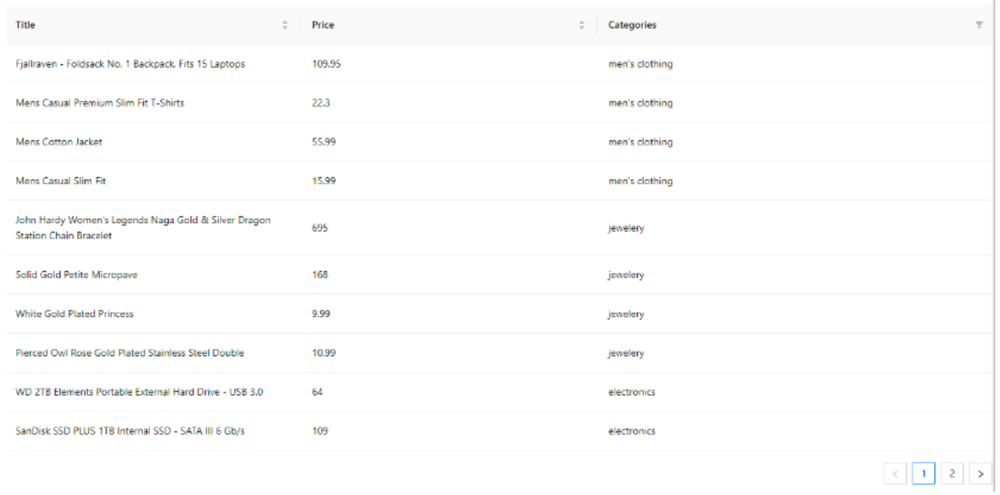

# React + Vite redux

This template provides a minimal setup to get React working in Vite with HMR and some ESLint rules.

Currently, two official plugins are available:

- [@vitejs/plugin-react](https://github.com/vitejs/vite-plugin-react/blob/main/packages/plugin-react/README.md) uses [Babel](https://babeljs.io/) for Fast Refresh
- [@vitejs/plugin-react-swc](https://github.com/vitejs/vite-plugin-react-swc) uses [SWC](https://swc.rs/) for Fast Refresh

- SIMULACIÓN PRUEBA TÉCNICA:

Desde el departamento de IT de The Bridge nos hemos lanzado al sector e-commerce y queremos tener listo cuanto antes un MVP.

El equipo de back ya nos ha preparado una API para hacer pruebas (alojada en https://fakestoreapi.com/) con los endpoints necesarios.
Lo mínimo que nos ha pedido el stakeholder para esta versión es que en la web pintemos una tabla mostrando los productos, en concreto:

Title
Category
Price

Proporcionando ordenación en todas las columnas y paginación.

Y que listemos los productos como en esta APP que ha visto:

Para esta primera versión no se va a valorar la calidad del diseño, puesto que nuestro diseñador se encuentra de vacaciones.
(Simulación realizada al final del bootcamp the full stack en The Bridge, encargado por Sofía Pinilla.)
<views id="contact">
<strong>Contacta</strong>

  

Patricia Fernández

(<a href="README.md#top">volver al principio </a>)

</views>
